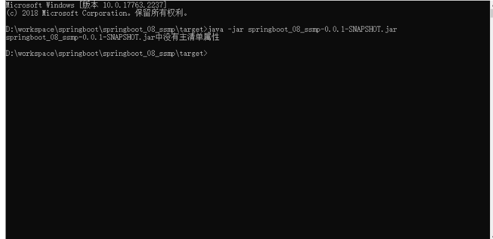
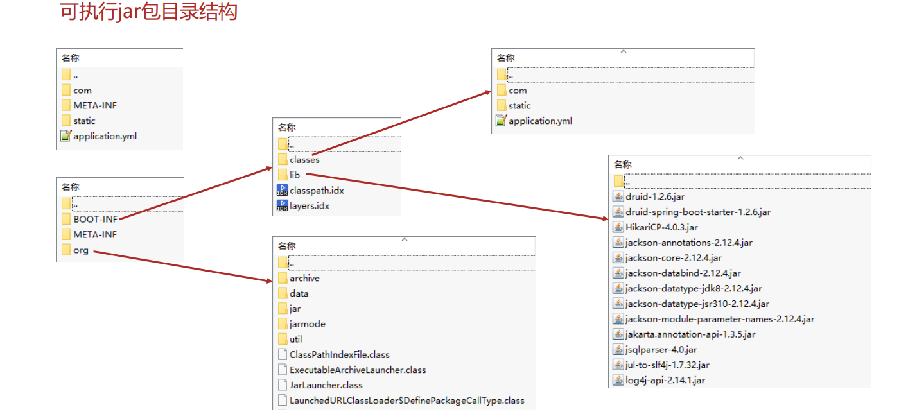
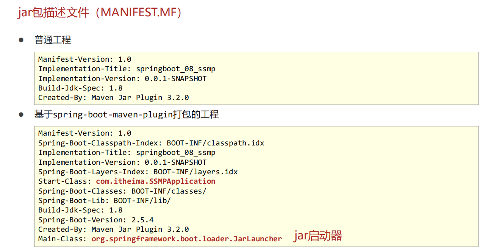
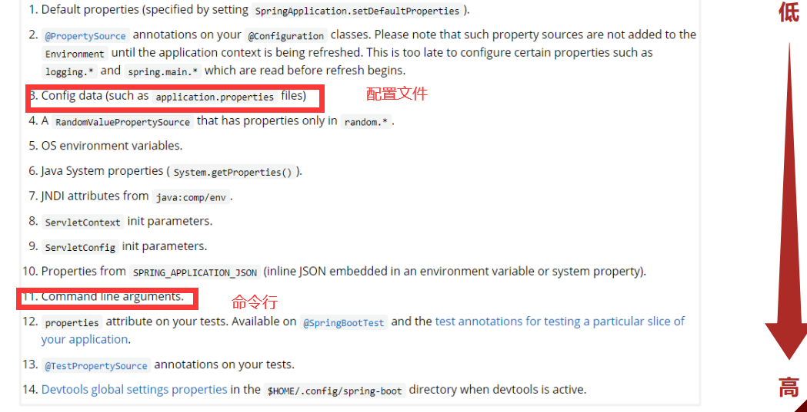
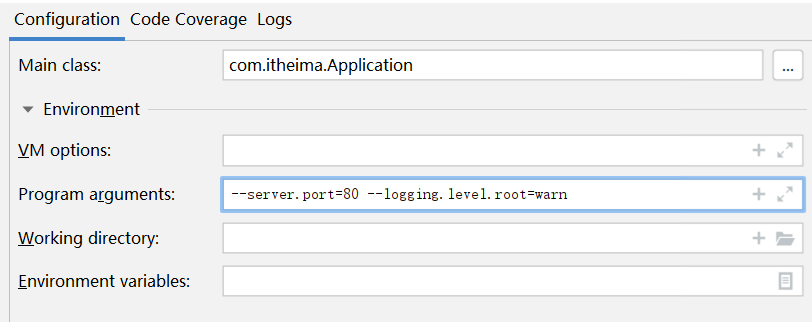
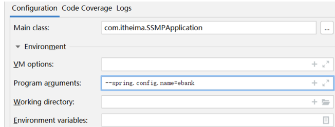
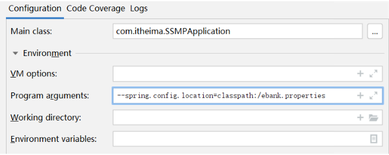
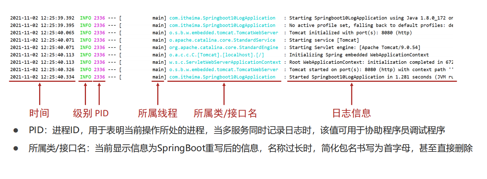

#                                SpringBoot运维实用

​	

​		实用篇共分为两块内容，分别是运维实用篇和开发实用篇。运维实用篇中都包含哪些内容：

- SpringBoot程序的打包与运行
- 配置高级
- 多环境开发
- 日志


## YW-1.SpringBoot程序的打包与运行

​		我们得代码运行也是在Idea下运行的。


​		但是实际开发完成后，我们的项目是不可能运行在自己的电脑上的。


​		我们以后制作的程序是运行在专用的服务器上的，简单说就是将你做的程序放在一台独立运行的电脑上，这台电脑要比你开发使用的计算机更专业，并且安全等级各个方面要远超过你现在的电脑。


​		那我们的程序如何放置在这台专用的电脑上呢，这就要将我们的程序先组织成一个文件，然后将这个文件传输到这台服务器上。这里面就存在两个过程，一个是打包的过程，另一个是运行的过程。

<font color="#f0f"><b>温馨提示</b></font>

​		企业项目上线为了保障环境适配性会采用下面流程发布项目，这里不讨论此过程。

1. 开发部门使用Git、SVN等版本控制工具上传工程到版本服务器
2. 服务器使用版本控制工具下载工程
3. 服务器上使用Maven工具在当前真机环境下重新构建项目
4. 启动服务

### **程序打包**

​		SpringBoot程序是基于Maven创建的，在Maven中提供有打包的指令，叫做package。本操作可以在Idea环境下执行。

```JAVA
mvn package
```

​		打包后会产生一个与工程名类似的jar文件，其名称是由模块名+版本号+.jar组成的。

### **程序运行**

​		程序包打好以后，就可以直接执行了。在程序包所在路径下，执行指令。

```JAVA
java -jar 工程包名.jar
```

​		执行程序打包指令后，程序正常运行，与在Idea下执行程序没有区别。

注意：

- ​	如果你的计算机中没有安装java的jdk环境，是无法正确执行上述操作的，因为程序执行使用的是java指令。

- ​	在使用向导创建SpringBoot工程时，pom.xml文件中会有如下配置，这一段配置千万不能删除，否则打包后无法正常执行程序。


```XML
<build>
    <plugins>
        <plugin>
            <groupId>org.springframework.boot</groupId>
            <artifactId>spring-boot-maven-plugin</artifactId>
        </plugin>
    </plugins>
</build>
```

**总结**

1. SpringBoot工程可以基于java环境下独立运行jar文件启动服务
2. SpringBoot工程执行mvn命令package进行打包
3. 执行jar命令：java –jar 工程名.jar


### SpringBoot程序打包失败处理

程序无法正常执行，例如下面的现象



​		搞java开发平时会接触很多jar包，比如mysql的驱动jar包，而上面我们打包程序后得到的也是一个jar文件。这个时候如果你使用上面的java -jar指令去执行mysql的驱动jar包就会出现上述不可执行的现象，而我们的SpringBoot项目为什么能执行呢？其实是因为打包方式不一样。

​		在SpringBoot工程的pom.xml中有下面这组配置，这组配置决定了打包出来的程序包是否可以执行。

```XML
<build>
    <plugins>
        <plugin>
            <groupId>org.springframework.boot</groupId>
            <artifactId>spring-boot-maven-plugin</artifactId>
        </plugin>
    </plugins>
</build>
```

​		我们分别开启这段配置和注释掉这段配置分别执行两次打包，然后观察两次打包后的程序包的差别，共有3处比较明显的特征

- 打包后文件的大小不同
- 打包后所包含的内容不同
- 打包程序中个别文件内容不同

​		先看第一个现象，文件大小不同。带有配置时打包生成的程序包大小如下：

​		我们发现内容也完全不一样，仅有一个目录是一样的，叫做META-INF。打开容量大的程序包中的BOOT-INF目录下的classes目录，我们发现其中的内容居然和容量小的程序包中的内容完全一样。

​		


​		仔细翻阅不难发现，这些jar文件都是我们制作这个工程时导入的坐标对应的文件。大概可以想明白了，SpringBoot程序为了让自己打包生成的程序可以独立运行，不仅将项目中自己开发的内容进行了打包，还把当前工程运行需要使用的jar包全部打包进来了。为什么这样做呢？就是为了可以独立运行。不依赖程序包外部的任何资源可以独立运行当前程序。这也是为什么大的程序包容量是小的程序包容量的30倍的主要原因。



​		现在这组设定的作用就搞清楚了

1. SpringBoot程序添加配置后会打出一个特殊的包，包含Spring框架部分功能，原始工程内容，原始工程依赖的jar包
2. 首先读取MANIFEST.MF文件中的Main-Class属性，用来标记执行java -jar命令后运行的类
3. JarLauncher类执行时会找到Start-Class属性，也就是启动类类名
4. 运行启动类时会运行当前工程的内容
5. 运行当前工程时会使用依赖的jar包，从lib目录中查找

​		看来SpringBoot打出来了包为了能够独立运行，简直是煞费苦心，将所有需要使用的资源全部都添加到了这个包里。这就是为什么这个jar包能独立运行的原因。

​		再来看之前的报错信息：


​		由于打包时没有使用那段配置，结果打包后形成了一个普通的jar包，在MANIFEST.MF文件中也就没有了Main-Class对应的属性了，所以运行时提示找不到主清单属性，这就是报错的原因。


### 命令行启动常见问题及解决方案

​		

```JAVA
# 查询端口
netstat -ano
# 查询指定端口
netstat -ano |findstr "端口号"
# 根据进程PID查询进程名称
tasklist |findstr "进程PID号"
# 根据PID杀死任务
taskkill /F /PID "进程PID号"
# 根据进程名称杀死任务
taskkill -f -t -im "进程名称"
```


## YW-2.配置高级

### YW-2-1.临时属性设置

​		目前我们的程序包打好了，可以发布了。但是程序包打好以后，里面的配置都已经是固定的了，比如配置了服务器的端口是8080。如果我要启动项目，发现当前我的服务器上已经有应用启动起来并且占用了8080端口，这个时候就尴尬了。难道要重新把打包好的程序修改一下吗？比如我要把打包好的程序启动端口改成80。


​		SpringBoot提供了灵活的配置方式，如果你发现你的项目中有个别属性需要重新配置，可以使用临时属性的方式快速修改某些配置。方法也特别简单，在启动的时候添加上对应参数就可以了。

```JAVA
java –jar springboot.jar –-server.port=80
```

​		上面的命令是启动SpringBoot程序包的命令，在命令输入完毕后，空一格，然后输入两个-号。下面按照属性名=属性值的形式添加对应参数就可以了。记得，这里的格式不是yaml中的书写格式，当属性存在多级名称时，中间使用点分隔，和properties文件中的属性格式完全相同。

​		如果你发现要修改的属性不止一个，可以按照上述格式继续写，属性与属性之间使用空格分隔。

```JAVA
java –jar springboot.jar –-server.port=80 --logging.level.root=debug
```

#### **属性加载优先级**

​		现在我们的程序配置受两个地方控制了，第一配置文件，第二临时属性。并且我们发现临时属性的加载优先级要高于配置文件的。打开官方文档中对应的内容，就可以查看配置读取的优先顺序。地址奉上：[https://docs.spring.io/spring-boot/docs/current/reference/html/spring-boot-features.html#boot-features-external-config](https://docs.spring.io/spring-boot/docs/current/reference/html/spring-boot-features.html)



因为命令行优先级比配置文件高，所以命令行上设置的临时属性就能覆盖配置文件里面设置的属性。

**总结**

1. 使用jar命令启动SpringBoot工程时可以使用临时属性替换配置文件中的属性
2. 临时属性添加方式：java –jar 工程名.jar –-属性名=值
3. 多个临时属性之间使用空格分隔
4. 临时属性必须是当前boot工程支持的属性，否则设置无效


#### 开发环境中使用临时属性

​		临时使用目前是有了，但是上线的时候通过命令行输入的临时属性必须是正确的啊，那这些属性配置值我们必须在开发环境中测试好才行。下面说一下开发环境中如何使用临时属性，其实就是Idea界面下如何操作了。

​		打开SpringBoot引导类的运行界面，在里面找到配置项。其中Program arguments对应的位置就是添加临时属性的，可以加几个试试效果。



​		做到这里其实可以产生一个思考了，如果对java编程熟悉的小伙伴应该知道，我们运行main方法的时候，如果想使用main方法的参数，也就是下面的args参数，就是在上面这个位置添加的参数。

```JAVA
public static void main(String[] args) {
}
```

​		原来是这样，通过这个args就可以获取到参数。再来看我们的引导类是如何书写的

```JAVA
public static void main(String[] args) {
    SpringApplication.run(SSMPApplication.class,args);
}
```

​		这个args参数居然传递给了run方法，看来在Idea中配置的临时参数就是通过这个位置传递到我们的程序中的。言外之意，这里如果不用这个args是不是就断开了外部传递临时属性的入口。

```JAVA
public static void main(String[] args) {
    SpringApplication.run(SSMPApplication.class);
}
```

​		或者还可以使用如下格式来玩这个操作，就是将配置不写在配置文件中，直接写成一个字符串数组，传递给程序入口。当然，这种做法并没有什么实际开发意义。

```JAVA
public static void main(String[] args) {
    String[] arg = new String[1];
    arg[0] = "--server.port=8082";
    SpringApplication.run(SSMPApplication.class, arg);
}
```

**总结**

1. 启动SpringBoot程序时，可以选择是否使用命令行属性为SpringBoot程序传递启动属性


### YW-2-2.配置文件分类

​		SpringBoot提供了配置文件和临时属性的方式来对程序进行配置。前面一直说的是临时属性，这一节要说说配置文件了。其实这个配置文件我们一直在使用，只不过我们用的是SpringBoot提供的4级配置文件中的其中一个级别。4个级别分别是：

- 类路径下配置文件（一直使用的是这个，也就是resources目录中的application.yml文件）
- 类路径下config目录下配置文件
- 程序包所在目录中配置文件
- 程序包所在目录中config目录下配置文件

上面4个文件的加载优先顺序为

1. file ：config/application.yml **【最高】**
2. file ：application.yml
3. classpath：config/application.yml
4. classpath：application.yml  **【最低】**

​		那为什么设计这种多种呢？说一个最典型的应用吧。

- 场景A：你作为一个开发者，你做程序的时候为了方便自己写代码，配置的数据库肯定是连接你自己本机的，咱们使用4这个级别，也就是之前一直用的application.yml。
- 场景B：现在项目开发到了一个阶段，要联调测试了，连接的数据库是测试服务器的数据库，肯定要换一组配置吧。你可以选择把你之前的文件中的内容都改了，目前还不麻烦。
- 场景C：测试完了，一切OK。你继续写你的代码，你发现你原来写的配置文件被改成测试服务器的内容了，你要再改回来。场景B中把你的内容都改掉了，你现在要重新改回来。
- 但是这也有一个问题，就是改来改去。

​		解决方案很简单，用上面的3这个级别的配置文件就可以快速解决这个问题，再写一个配置就行了。两个配置文件共存，因为config目录中的配置加载优先级比你的高，所以配置项如果和级别4里面的内容相同就覆盖了

**总结**

1. 配置文件分为4种

   - 项目类路径配置文件：服务于开发人员本机开发与测试
   - 项目类路径config目录中配置文件：服务于项目经理整体调控
   - 工程路径配置文件：服务于运维人员配置涉密线上环境
   - 工程路径config目录中配置文件：服务于运维经理整体调控

2. 多层级配置文件间的属性采用叠加并覆盖的形式作用于程序


### YW-2-3.自定义配置文件

​		之前咱们做配置使用的配置文件都是application.yml，其实这个文件也是可以改名字的，这样方便维护。比如我2020年4月1日搞活动，走了一组配置，2020年5月1日活动取消，恢复原始配置，这个时候只需要重新更换一下配置文件就可以了。但是你总不能在原始配置文件上修改吧，不然搞完活动以后，活动的配置就留不下来了，不利于维护。

​		自定义配置文件方式有如下两种：

**方式一：使用临时属性设置配置文件名，注意仅仅是名称，不要带扩展名**



**方式二：使用临时属性设置配置文件路径，这个是全路径名**



​		也可以设置加载多个配置文件


​		使用的属性一个是spring.config.name，另一个是spring.config.location，这个一定要区别清楚。

**总结**

1. 配置文件可以修改名称，通过启动参数设定
2. 配置文件可以修改路径，通过启动参数设定
3. 微服务开发中配置文件通过配置中心进行设置

## YW-3.多环境开发

​		什么是多环境？其实就是说你的电脑上写的程序最终要放到别人的服务器上去运行。每个计算机环境不一样，这就是多环境。常见的多环境开发主要兼顾3种环境设置，开发环境——自己用的，测试环境——自己公司用的，生产环境——甲方爸爸用的。因为这是绝对不同的三台电脑，所以环境肯定有所不同，比如连接的数据库不一样，设置的访问端口不一样等等。

### YW-3-1.多环境开发（yaml单一文件版）	

​	自己开发时，配置你的端口如下：

```yaml
server:
  port: 80
```

​		如何想设计两组环境呢？中间使用三个减号分隔开

```yaml
server:
  port: 80
---
server:
  port: 81
```

​		如何区分两种环境呢？

```yaml
spring:
	profiles: pro
server:
	port: 80
---
spring:
	profiles: dev
server:
	port: 81
```

​		那用哪一个呢？设置默认启动哪个就可以了

```yaml
spring:
	profiles:
		active: pro		# 启动pro
---
spring:
	profiles: pro
server:
	port: 80
---
spring:
	profiles: dev
server:
	port: 81
```

​		其中关于环境名称定义上述格式是过时格式，标准格式如下

```yaml
spring:
	config:
    	activate:
        	on-profile: pro
```

**总结**

1. 多环境开发需要设置若干种常用环境，例如开发、生产、测试环境
2. yaml格式中设置多环境使用---区分环境设置边界
3. 每种环境的区别在于加载的配置属性不同
4. 启用某种环境时需要指定启动时使用该环境

### YW-3-2.多环境开发（yaml多文件版）	

​		将所有的配置都放在一个配置文件中，尤其是每一个配置应用场景都不一样，这显然不合理，于是就有了将一个配置文件拆分成多个配置文件的想法。拆分后，每个配置文件中写自己的配置，主配置文件中写清楚用哪一个配置文件就好了。

**主配置文件**

```yaml
spring:
	profiles:
		active: pro		# 启动pro
```

**环境配置文件**

```yaml
server:
	port: 80
```

​		环境配置文件因为每一个都是配置自己的项，所以连名字都不用写里面了。那问题是如何区分这是哪一组配置呢？使用文件名区分。

**application-pro.yaml**

```yaml
server:
	port: 80
```

**application-dev.yaml**

```yaml
server:
	port: 81
```

​		文件的命名规则为：application-环境名.yml。

​		在配置文件中，如果某些配置项所有环境都一样，可以将这些项写入到主配置中，只有哪些有区别的项才写入到环境配置文件中。

- 主配置文件中设置公共配置（全局）
- 环境分类配置文件中常用于设置冲突属性（局部）

**总结**

1. 可以使用独立配置文件定义环境属性

2. 独立配置文件便于线上系统维护更新并保障系统安全性

   

### YW-3-3.多环境开发（properties多文件版）

​		SpringBoot最早期提供的配置文件格式是properties格式的，这种格式的多环境配置也了解一下吧。

**主配置文件**

```properties
spring.profiles.active=pro
```

**环境配置文件**

**application-pro.properties**

```properties
server.port=80
```

**application-dev.properties**

```properties
server.port=81
```

​		文件的命名规则为：application-环境名.properties。

**总结**

1. properties文件多环境配置仅支持多文件格式

### YW-3-4.多环境开发独立配置文件书写技巧

**准备工作**

​		将所有的配置根据功能对配置文件中的信息进行拆分，并制作成独立的配置文件，命名规则如下

- application-devDB.yml
- application-devRedis.yml
- application-devMVC.yml

**使用**

​		使用include属性在激活指定环境的情况下，同时对多个环境进行加载使其生效，多个环境间使用逗号分隔

```yaml
spring:
	profiles:
    	active: dev
        include: devDB,devRedis,devMVC
```

**注意**

​		当主环境dev与其他环境有相同属性时，主环境属性生效；其他环境中有相同属性时，最后加载的环境属性生效

**改良**

​		但是上面的设置也有一个问题，比如我要切换dev环境为pro时，include也要修改。因为include属性只能使用一次，这就比较麻烦了。SpringBoot从2.4版开始使用group属性替代include属性，降低了配置书写量。简单说就是我先写好，你爱用哪个用哪个。

```yaml
spring:
	profiles:
    	active: dev
        group:
        	"dev": devDB,devRedis,devMVC
      		"pro": proDB,proRedis,proMVC
      		"test": testDB,testRedis,testMVC
```

​		现在再来看，如果切换dev到pro，只需要改一下就结束了

### YW-3-5.多环境开发控制

就是maven和SpringBoot同时设置多环境的话怎么搞。

​		要想处理这个冲突问题，你要先理清一个关系，究竟谁在多环境开发中其主导地位。也就是说如果现在都设置了多环境，谁的应该是保留下来的，另一个应该遵从相同的设置。

​		maven是做什么的？项目构建管理的，最终生成代码包的，SpringBoot是干什么的？简化开发的。简化，又不是其主导作用。最终还是要靠maven来管理整个工程，所以SpringBoot应该听maven的。整个确认后下面就好做了。大体思想如下：

- 先在maven环境中设置用什么具体的环境
- 在SpringBoot中读取maven设置的环境即可

**maven中设置多环境（使用属性方式区分环境）**

```xml
<profiles>
    <profile>
        <id>env_dev</id>
        <properties>
            <profile.active>dev</profile.active>
        </properties>
        <activation>
            <activeByDefault>true</activeByDefault>		<!--默认启动环境-->
        </activation>
    </profile>
    <profile>
        <id>env_pro</id>
        <properties>
            <profile.active>pro</profile.active>
        </properties>
    </profile>
</profiles>
```

**SpringBoot中读取maven设置值**

```yaml
spring:
	profiles:
    	active: @profile.active@
```

​		上面的@属性名@就是读取maven中配置的属性值的语法格式。

注意：

有时候会出现你设置了默认启动环境。但是不生效，你需要在maven环境中执行complie才能解决。

**总结**

1. 当Maven与SpringBoot同时对多环境进行控制时，以Mavn为主，SpringBoot使用@..@占位符读取Maven对应的配置属性值
2. 基于SpringBoot读取Maven配置属性的前提下，如果在Idea下测试工程时pom.xml每次更新需要手动compile方可生效


## YW-4.日志

​		运维篇最后一部分我们来聊聊日志，日志大家不陌生，简单介绍一下。日志其实就是记录程序日常运行的信息，主要作用如下：

- 编程期调试代码
- 运营期记录信息
- 记录日常运营重要信息（峰值流量、平均响应时长……）
- 记录应用报错信息（错误堆栈）
- 记录运维过程数据（扩容、宕机、报警……）

​		或许各位小伙伴并不习惯于使用日志，没关系，慢慢多用，习惯就好。想进大厂，这是最基本的，别去面试的时候说没用过，完了，没机会了。

#### YW-4-1.代码中使用日志工具记录日志

​		日志的使用格式非常固定，直接上操作步骤：

**步骤①**：添加日志记录操作

```JAVA
@RestController
@RequestMapping("/books")
public class BookController extends BaseClass{
    private static final Logger log = LoggerFactory.getLogger(BookController.class);
    @GetMapping
    public String getById(){
        log.debug("debug...");
        log.info("info...");
        log.warn("warn...");
        log.error("error...");
        return "springboot is running...2";
    }
}
```

​		上述代码中log对象就是用来记录日志的对象，下面的log.debug，log.info这些操作就是写日志的API了。

**步骤②**：设置日志输出级别

​		日志设置好以后可以根据设置选择哪些参与记录。这里是根据日志的级别来设置的。日志的级别分为6种，分别是：

- TRACE：运行堆栈信息，使用率低
- DEBUG：程序员调试代码使用
- INFO：记录运维过程数据
- WARN：记录运维过程报警数据
- ERROR：记录错误堆栈信息
- FATAL：灾难信息，合并计入ERROR

​		一般情况下，开发时候使用DEBUG，上线后使用INFO，运维信息记录使用WARN即可。下面就设置一下日志级别：

```yaml
# 开启debug模式，输出调试信息，常用于检查系统运行状况
debug: true
```

​		这么设置太简单粗暴了，日志系统通常都提供了细粒度的控制

```yaml
# 开启debug模式，输出调试信息，常用于检查系统运行状况
debug: true

# 设置日志级别，root表示根节点，即整体应用日志级别
logging:
	level:
    	root: debug
```

​		还可以再设置更细粒度的控制

**步骤③**：设置日志组，控制指定包对应的日志输出级别，也可以直接控制指定包对应的日志输出级别

```yaml
logging:
	# 设置日志组
    group:
    	# 自定义组名，设置当前组中所包含的包
        ebank: com.itheima.controller
    level:
    	root: warn
        # 为对应组设置日志级别
        ebank: debug
    	# 为对包设置日志级别
        com.itheima.controller: debug
```

**总结**

1. 日志用于记录开发调试与运维过程消息
2. 日志的级别共6种，通常使用4种即可，分别是DEBUG，INFO,WARN,ERROR
3. 可以通过日志组或代码包的形式进行日志显示级别的控制


#### 教你一招：优化日志对象创建代码

​		写代码的时候每个类都要写创建日志记录对象，这个可以优化一下，使用前面用过的lombok技术给我们提供的工具类即可。

```JAVA
@RestController
@RequestMapping("/books")
public class BookController extends BaseClass{
    private static final Logger log = LoggerFactory.getLogger(BookController.class);	//这一句可以不写了
}
```

​		导入lombok后使用注解搞定，日志对象名为log

```JAVA
@Slf4j		//这个注解替代了下面那一行
@RestController
@RequestMapping("/books")
public class BookController extends BaseClass{
    private static final Logger log = LoggerFactory.getLogger(BookController.class);	//这一句可以不写了
}
```

**总结**

1. 基于lombok提供的@Slf4j注解为类快速添加日志对象


#### YW-4-2.日志输出格式控制

​		日志已经能够记录了，但是目前记录的格式是SpringBoot给我们提供的，如果想自定义控制就需要自己设置了。先分析一下当前日志的记录格式。

​		对于单条日志信息来说，日期，触发位置，记录信息是最核心的信息。级别用于做筛选过滤，PID与线程名用于做精准分析。了解这些信息后就可以DIY日志格式了。本课程不做详细的研究，有兴趣的小伙伴可以学习相关的知识。下面给出课程中模拟的官方日志模板的书写格式，便于大家学习。




```yml
logging:
	pattern:
    	console: "%d %clr(%p) --- [%16t] %clr(%-40.40c){cyan} : %m %n"
```


#### YW-4-3.日志文件

​		日志信息显示，记录已经控制住了，下面就要说一下日志的转存了。日志不能仅显示在控制台上，要把日志记录到文件中，方便后期维护查阅。

​		对于日志文件的使用存在各种各样的策略，例如每日记录，分类记录，报警后记录等。这里主要研究日志文件如何记录。

​		记录日志到文件中格式非常简单，设置日志文件名即可。

```YAML
logging:
	file:
    	name: server.log
```

​		虽然使用上述格式可以将日志记录下来了，但是面对线上的复杂情况，一个文件记录肯定是不能够满足运维要求的，通常会每天记录日志文件，同时为了便于维护，还要限制每个日志文件的大小。下面给出日志文件的常用配置方式：

```YAML
logging:
	logback:
    	rollingpolicy:
        	max-file-size: 3KB
            file-name-pattern: server.%d{yyyy-MM-dd}.%i.log
```

​		以上格式是基于logback日志技术设置每日日志文件的设置格式，要求容量到达3KB以后就转存信息到第二个文件中。文件命名规则中的%d标识日期，%i是一个递增变量，用于区分日志文件。

**总结**

1. 日志记录到文件
2. 日志文件格式设置


